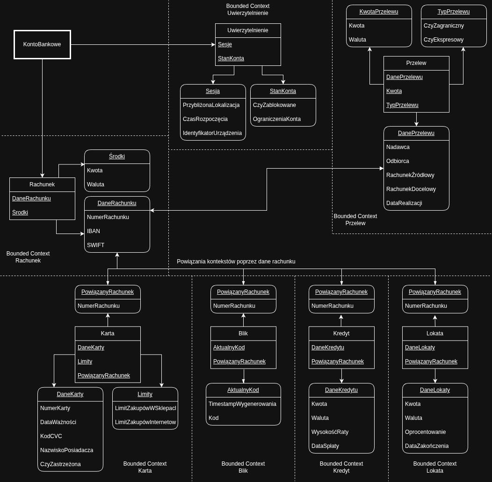

# Zadanie 1.

Poniższy schemat (dostępny również w pliku ddd.drawio.png) określa prosty model aplikacji bankowej posiadający wiele funkcjonalności. Użytkownik posiadający konto w banku może posiadać wiele Rachunków, z którymi powiązane mogą być Karty i Kredyty, użytkownik może również korzystać z systemu Blik. Wszystkie zapytania kierowane do API banku są weryfikowane pod kątem podejrzanej aktywności, a sesje są automatycznie kończone po przekroczeniu maksymalnego czasu trwania.

Aggregate root: KontoBankowe - spina podstawowe elementy schematu konta - Uwierzytelnienie oraz Rachunek

## Konteksty

### Uwierzytelnienie

Moduł odpowiedzialny za uwierzytelnienie użytkownika i zarządzanie sesją.

Encja **Uwierzytelnienie**  
VO <u>Sesja</u>:
- PrzybliżonaLokalizacja - `para liczb` oznaczających długość i szerokość geograficzną przyporządkowaną na podstawie adresu IP z którego nastąpiło logowanie.
- CzasRozpoczęcia - `timestamp` oznaczający moment rozpoczęcia sesji
- IdentyfikatorUrządzenia - `string` będący kombinacją parametrów takich jak raportowany przez przeglądarkę internetową User-Agent, rozdzielczości ekranu i innych danych używanych do identyfikacji użytkowników w sieci

VO <u>StanKonta</u>:
- CzyZablokowane - `bool`, określa, czy na konto można się zalogować, czy potrzebne jest jego odblokowanie ze względu na wiele nieudanych prób logowania lub wiele podejrzanych prób logowania lub operacji.
- OgraniczeniaKonta - `zbiór flag` określający jakie funkcjonalności konta są aktywne - takie jak możliwość wypłacania lub wpłacania gotówki, możliwość dokonywania przelewów itp.

Funkcjonalności:  
- Zalogowanie - użytkownik logowany jest po podaniu prawidłowego loginu i hasła oraz opcjonalnie przejściu przez etap uwierzytelniania dwuskładnikowego. Użytkownik może nie zostać zalogowany nawet jeżeli zostaną podane poprawne dane jeżeli lokalizacja logowania i dane identyfikacyjne urządzenia które próbuje się zalogować znacząco różnią się od ostatnich sesji. W przypadku wielu nieudanych logowań lub odnotowania dużej liczby podejrzanych (np. ze znacząco różniących się lokalizacji) konto może zostać automatycznie zablokowane, lub mogą na nie zostać nałożone ograniczenia związane np. z brakiem możliwości wypłacania gotówki lub dokonywaniem przelewów wychodzących.
- Zakończenie sesji - Sesja jest unieważniana jeżeli użytkownik wyloguje się albo jeżeli minie 15 minut od rozpoczęcia sesji.
- Weryfikacja zapytań - Każde zapytanie do API weryfikowane jest pod kątem przesyłanych danych identyfikujących urządzenie i lokalizacji, jeżeli nastąpi ich gwałtowna zmiania to sesja jest unieważniana.

### Rachunek

Moduł odpowiedzialny za utrzymywanie stanu pieniężnego konta, wiążący również inne elementy składowe poprzez NumerRachunku.

Encja **Rachunek**  
VO <u>Środki</u>
- Kwota - `liczba stałoprzecinkowa` oznaczająca liczbę środków w danej walucie.
- Waluta - `waluta` oznaczająca typ waluty.
- Rachunek może zawierać środki w wielu walutach jednocześnie, więc posiada zbiór różnych VO środki.

- VO <u>DaneRachunku</u>
- NumerRachunku - `string` 26 cyfr wyrażające numer rachunku.
- IBAN - `string`, 28 znaków, NumerRachunku zawierający dodatkowo kod kraju.
- SWIFT - `string`, 8 lub 11 znaków, identyfikator banku konta w systemie SWIFT.

Funkcjonalności:
- Dodanie waluty - Dodanie kolejnej VO Środki na przechowywanie środków w innej walucie.
- Przewalutowanie środków - zamiana środów z jednego VO środki na środki w innej walucie innego VO środki.

### Karta

Moduł odpowiedzialny za operacje płatności kartą i zarządzanie nią.

Encja **Karta**
VO <u>DaneKarty</u>
- NumerKarty - `string` 16 cyfr, numer karty
- DataWażności - `timestamp` oznaczający termin ważności karty. Karta przestaje działać po upłynięciu danego terminu.
- KodCVC - `string` 3 cyfry, kod zabezpieczający karty wykorzystywany np. przy płatnościach online.
- NazwiskoPosiadacza - `string`, nazwisko posiadacza zapisane na fizycznej karcie.
- CzyZastrzeżona - `bool`, jeżeli karta jest zastrzeżona to nie jest możliwe dokonywanie nią żadnych operacji.

VO <u>Limity</u>
- LimitZakupówWSklepach - `liczba stałoprzecinkowa` wyrażająca maksymalną kwotę dziennych operacji kartą w transakcjach w m. in. sklepach.
- LimitZakupówInternetowych - `liczba stałoprzecinkowa` wyrażająca maksymalną kwotę dziennych operacji kartą w płatnościach online
- LimitWypłat - `liczba stałoprzecinkowa` wyrażająca maksymalną kwotę dziennych wypłat z bankomatów.

VO <u>PowiązanyRachunek</u>
- NumerRachunku - `string` 26 cyfr, wiąże Kartę z Rachunkiem.

Funkcjonalności:
- Dokonywanie płatności - jeżeli karta nie jest zastrzeżona, limit na płatność danego typu nie zostanie przekroczony oraz na Rachunku powiązanym z Kartą znajduje się wystarczająca ilość środków, to możliwe jest dokonanie płatności, które powoduje obciążenie powiązanego Rachunku na kwotę płatności.
- Wypłata pieniędzy - jeżeli karta nie jest zastrzeżona, limit wypłat nie zostanie przekroczony oraz na Rachunku powiązanym z Kartą znajduje się wystarczająca ilość środków, to możliwe jest wypłacenie pieniędzy, skutkujące pomniejszeniem ilości Środków na powiązanym Rachunku równym kwocie wypłaconej gotówki.
- Zastrzeżenie karty - powoduje nieodwracalne "wyłączenie" możliwości korzystanie z Karty oraz automatyczne zamówienie Karty zamiennej.

### Blik

Moduł odpowiedzialny za operacje w systemie Blik.

Encja **Blik**  
VO <u>AktualnyKod</u>
- TimestampWygenerowania - `timestamp` oznaczający początek okresu ważności kodu, trwającego 120 sekund.
- Kod - `string` 6 cyfr będące kodem Blik służącym do dokonywania płatności w systemie.

VO <u>PowiązanyRachunek</u>
- NumerRachunku - `string` 26 cyfr, wiąże Blik z Rachunkiem.
- NumerTelefonu - `string` 9 cyfr, numer telefonu powiązany z danym Rachunkiem w usłudze Blik

Funkcjonalności:
- Wygenerowanie kodu - generuje nowy AktualnyKod służący do dokonywania operacji w systemie Blik.
- Akceptacja płatności - po wprowadzeniu AktualnegoKodu Blik np. w sklepie internetowym przyjmującym płatność za pośrednictwem systemu, użytkownik musi zaakceptować transakcję potwierdzając ją, mając jednocześnie wgląd w dane podmiotu który otrzyma płatność oraz kwoty, na którą powiązany Rachunek zostanie obciążony. 
- Przelew na telefon - na podstawie wprowadzonego numeru telefonu innego użytkownika powiązanego z Rachunkiem w banku korzystającego z usługi Blik możliwe jest przesłanie środków z powiązanego Rachunku.

### Kredyt

Moduł odpowiedzialny za zaciąganie i spłacanie kredytów. Rachunek może mieć więcej niż jeden powiązany Kredyt.

Encja **Kredyt**

VO <u>DaneKredytu</u>
- Kwota - `liczba stałoprzecinkowa` wyrażająca kwotę zaciągniętego Kredytu.
- Waluta - `waluta` określająca walutę w jakiej kredyt został zaciągnięty.
- DoSpłaty - `liczba stałoprzecinkowa` wyrażająca kwotę, która pozostała do spłaty Kredytu.
- DataSpłaty - `timestamp`, przewidywana data spłaty kredytu.

VO <u>DaneRaty</u>
- WysokośćRaty - `liczba stałoprzecinkowa` określająca wysokość comiesięcznej raty.
- Waluta - `waluta` określająca walutę w jakiej kredyt jest spłacany (która może być inna niż waluta w której został zaciągnięty).

VO <u>PowiązanyRachunek</u>
- NumerRachunku - `string` 26 cyfr, wiąże Kredyt z Rachunkiem.

Funkcjonalności:
- Nowy kredyt - zaciągnięcie nowego kredytu - możliwe wtedy, kiedy użytkownik nie zaciągnął zbyt wielu kredytów oraz jeżeli jego KontoBankowe nie jest ograniczone pod tym względem.
- Spłata raty - spłata raty kredytu, pobieranej automatycznie jeżeli stan powiązanego Rachunku na to pozwala, aktualizuje DatęSpłaty kredytu jeżeli nie udało się jej dokonać.
- Spłata kredytu - spłata całej pozostałej kwoty kredytu, dokonywana jeżeli na powiązanym Rachunku znajduje się wystarczająca ilość Środków.
- Zmiana waluty spłaty - pozwala zmienić walutę w której kredyt jest spłacany, zmienia też WysokośćRaty na podstawie kursu bankowego.

### Przelew

Moduł odpowiedzialny za realizację przelewów.

Encja **Przelew**

VO <u>KwotaPrzelewu</u>
- Kwota - `liczba stałoprzecinkowa` wyrażająca kwotę przesyłaną w przelewie
- Waluta - `waluta` w jakiej wysyłane są środki

VO <u>TypPrzelewu</u>
- CzyZagraniczny - `bool`, jeżeli tak, to za zlecenie takiego przelewu pobierane są odpowiednie dodatkowe opłaty
- CzyEkspresowy - `bool`, jeżeli tak to za zlecenie takiego przelewu pobierane są odpowiednie dodatkowe opłaty, oraz przelew wykonywany jest natychmiast niezależnie od godziny ani dnia tygodnia.

VO <u>DanePrzelewu</u>
- Nazwa - `string`, nazwa przelewu
- Nadawca - `string`, dane osobowe osoby wysyłającej Środki
- Odbiorca - `string`, dane osobowe osoby do której Przelew ma trafić
- RachunekŹródłowy - `string`, 26 cyfr wiążące Przelew z Rachunkiem z którego Środki zostaną wysłane
- RachunekDocelowy - `string`, 26 cyfr wiążące Przelew z Rachunkiem na który Środki zostaną dostarczone
- SWIFTDocelowy - `string`, 8 lub 11 cyfr, dodatkowy identyfikator konta w przypadku przelewów zagranicznych.
- DataZlecenia - `timestamp`, określa moment zlecenia Przelewu
- DataRealizacji - `timestamp`, określa moment realizacji Przelewu, różni się od DatyZlecenia w przypadku przelewów nie będących przelewami ekspresowymi.

Funkcjonalności:
- Wysłanie przelewu - realizacja przelewu podanego na podane konto na daną kwotę, dokonuje się jeżeli dostępne na RachunkuŹródłowym Środki pozwalają na jego realizację. Kwota przesyłana jest wtedy na RachunekDocelowy. Przelew jest blokowany w przypadku wykrycia podejrzanej nazwy zawierającej słowa typu "bomba" itp., w przypadku wykrycia podejrzanej aktywności przez systemy banku lub niezgodności wpisanych danych odbiorcy z danymi zapisanymi w systemie (co może oznaczać pomyłkę)
- Wycofanie przelewu - zgłoszenie chęci cofnięcia wykonanego przelewu, po pozytywnym rozpatrzeniu wniosku przez bank operacja jest cofana.